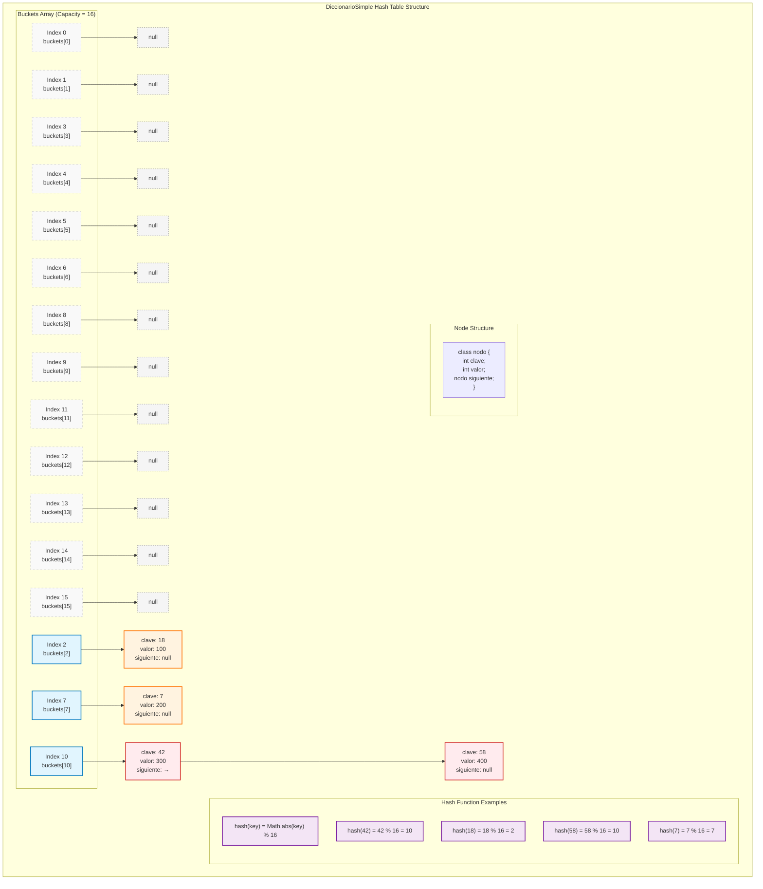

# DiccionarioSimple - Hash Table Implementation

## Overview
`DiccionarioSimple` is a hash table implementation that stores key-value pairs using separate chaining for collision resolution. It provides O(1) average time complexity for basic operations (insert, search, delete).

## Internal Structure

### Hash Table Components
- **Buckets Array**: Fixed-size array of pointers to linked lists
- **Node Structure**: Each node contains key, value, and pointer to next node
- **Hash Function**: Maps keys to bucket indices using modulo operation

### Data Structure Visualization



#### ASCII Alternative View
```
buckets[16]:
┌─────┬─────┬─────┬─────┬─────┬─────┬─────┬─────┬─────┬─────┬─────┬─────┬─────┬─────┬─────┬─────┐
│  0  │  1  │  2  │  3  │  4  │  5  │  6  │  7  │  8  │  9  │ 10  │ 11  │ 12  │ 13  │ 14  │ 15  │
└─────┴─────┴─────┴─────┴─────┴─────┴─────┴─────┴─────┴─────┴─────┴─────┴─────┴─────┴─────┴─────┘
│null │null │  ●  │null │null │null │null │  ●  │null │null │  ●  │null │null │null │null │null │
           │                                   │                   │
           ▼                                   ▼                   ▼
    ┌──────────┐                      ┌──────────┐         ┌──────────┐
    │ key: 18  │                      │ key: 7   │         │ key: 42  │
    │ val: 100 │                      │ val: 200 │         │ val: 300 │
    │ next:null│                      │ next:null│         │ next: ●  │
    └──────────┘                      └──────────┘         └──────────┘
                                                                     │
                                                                     ▼
                                                              ┌──────────┐
                                                              │ key: 58  │
                                                              │ val: 400 │
                                                              │ next:null│
                                                              └──────────┘
```

## Example Operations

### 1. Hash Function
```java
private int hash(int clave) {
    return Math.abs(clave) % capacidad;
}
```

**Examples:**
- `hash(18) = 18 % 16 = 2` → Goes to bucket 2
- `hash(7) = 7 % 16 = 7` → Goes to bucket 7  
- `hash(42) = 42 % 16 = 10` → Goes to bucket 10
- `hash(58) = 58 % 16 = 10` → **COLLISION!** Also goes to bucket 10

### 2. Collision Resolution (Separate Chaining)

When two keys hash to the same bucket (like keys 42 and 58 both going to bucket 10), they form a linked list:

```
Bucket 10: [42,300] → [58,400] → null
```

### 3. Insertion Process

1. **Calculate hash**: `index = hash(key)`
2. **Search bucket**: Check if key already exists in linked list
3. **Update or Insert**: 
   - If key exists: update value
   - If key doesn't exist: create new node at head of list

### 4. Search Process

1. **Calculate hash**: `index = hash(key)`
2. **Traverse linked list**: Search through nodes in bucket[index]
3. **Return value**: If found, return associated value; otherwise return 0

## Load Factor and Resizing

- **Load Factor Threshold**: 0.75
- **Initial Capacity**: 16 buckets
- **Resizing Strategy**: Double capacity when load factor exceeds threshold
- **Rehashing**: All elements are redistributed using new capacity

### Before Resizing (Capacity = 16, Size = 12)
```
Load Factor = 12/16 = 0.75 ≥ 0.75 → RESIZE TRIGGERED
```

### After Resizing (Capacity = 32, Size = 12)
```
Load Factor = 12/32 = 0.375 < 0.75 → Optimal performance
```

## Complexity Analysis

| Operation | Average Case | Worst Case |
|-----------|--------------|------------|
| Insert    | O(1)         | O(n)       |
| Search    | O(1)         | O(n)       |
| Delete    | O(1)         | O(n)       |
| Resize    | O(n)         | O(n)       |

**Note**: Worst case occurs when all keys hash to the same bucket, creating a long linked list.

## Key Features

1. **Dynamic Resizing**: Automatically grows to maintain performance
2. **Collision Handling**: Uses separate chaining with linked lists
3. **Memory Efficient**: Only allocates space for actual elements
4. **Generic Operations**: Supports standard dictionary operations

## Implementation Details

### Node Structure
```java
class nodo {
    int clave;      // Key
    int valor;      // Value  
    nodo siguiente; // Pointer to next node in chain
}
```

### Main Fields
```java
private nodo[] buckets;                    // Array of bucket heads
private int capacidad = 16;                // Current capacity
private int size = 0;                      // Number of elements
private static final double FACTOR_CARGA = 0.75; // Load factor limit
```

This implementation provides efficient key-value storage with automatic performance optimization through dynamic resizing. 