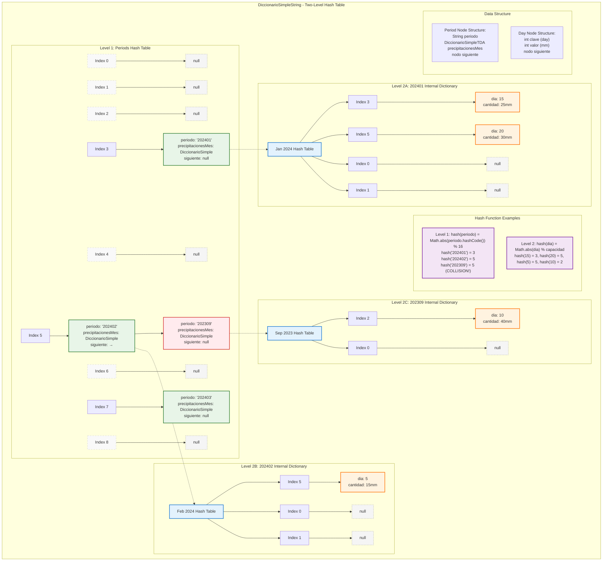

# DiccionarioSimpleString - Two-Level Hash Table Implementation

## Overview
`DiccionarioSimpleString` implements a specialized two-level hash table designed for storing precipitation data by periods and days. It maps **String periods** (like "202401") to **DiccionarioSimpleTDA** objects, which internally store daily precipitation measurements.

## Architecture: Nested Hash Tables

### Level 1: Period Hash Table (String → DiccionarioSimple)
- **Keys**: Period strings (format: "YYYYMM" like "202401", "202402")
- **Values**: DiccionarioSimpleTDA instances (each containing daily data)
- **Collision Resolution**: Separate chaining with linked lists

### Level 2: Daily Hash Table (int → int) 
- **Keys**: Day numbers (1-31)
- **Values**: Precipitation amounts in mm
- **Implementation**: Standard DiccionarioSimple for each period

## Data Structure Visualization



#### ASCII Alternative View
```
DiccionarioSimpleString (Level 1):
┌─────┬─────┬─────┬─────┬─────┬─────┬─────┬─────┐
│  0  │  1  │  2  │  3  │  4  │  5  │  6  │  7  │
└─────┴─────┴─────┴─────┴─────┴─────┴─────┴─────┘
│null │null │null │  ●  │null │  ●  │null │  ●  │
                  │           │           │
                  ▼           ▼           ▼
            ┌────────────┐ ┌────────────┐ ┌────────────┐
            │202401      │ │202402   ●──┼─│202403      │
            │Jan 2024    │ │Feb 2024    │ │Mar 2024    │
            │Dict ●──────┼─│Dict ●──────┼─│Dict ●──────┼─
            └────────────┘ └──┼─────────┘ └────────────┘
                 │            │                │
                 ▼            ▼                ▼
         ┌──────────────┐ ┌──────────────┐ ┌──────────────┐
         │ 202309       │ │              │ │              │
         │ Sep 2023     │ │              │ │              │
         │ Dict ●───────┼─│              │ │              │
         └──────────────┘ └──────────────┘ └──────────────┘
                │
                ▼
        
Level 2 - Internal Dictionaries:

Jan 2024 (202401):           Feb 2024 (202402):
┌───┬───┬───┬───┬───┐        ┌───┬───┬───┬───┬───┐
│ 0 │ 1 │ 2 │ 3 │ 4 │        │ 0 │ 1 │ 2 │ 3 │ 4 │
└───┴───┴───┴───┴───┘        └───┴───┴───┴───┴───┘
│   │   │   │●  │●  │        │   │   │   │   │   │
          │   │   │            │   │   │   │   │
          ▼   ▼   ▼            ▼   ▼   ▼   ▼   ▼
        [15][20]             [null across all]
        25mm 30mm            
                             ┌───┬───┐
                             │ 5 │...│
                             └───┴───┘
                             │●  │
                             ▼
                            [5]
                            15mm
```

## Example Operations

### 1. String Hash Function
```java
private int hash(String periodo) {
    if (periodo == null) return 0;
    return Math.abs(periodo.hashCode()) % capacidad;
}
```

**Examples:**
- `hash("202401") = Math.abs("202401".hashCode()) % 16 = 3`
- `hash("202402") = Math.abs("202402".hashCode()) % 16 = 5`
- `hash("202309") = Math.abs("202309".hashCode()) % 16 = 5` → **COLLISION!**

### 2. Two-Level Insertion Process

When calling `agregar("202401", 15, 25)`:

1. **Level 1 - Find/Create Period**:
   ```java
   int indice = hash("202401"); // Returns 3
   // Search bucket 3 for period "202401"
   // If not found, create new period node
   ```

2. **Level 2 - Add Daily Measurement**:
   ```java
   // Get or create internal DiccionarioSimple for "202401"
   DiccionarioSimpleTDA interno = nodo.precipitacionesMes;
   interno.agregar(15, 25); // Day 15: 25mm
   ```

### 3. Collision Handling Example

Both "202402" and "202309" hash to bucket 5:
```
Bucket 5: ["202402", Feb2024Dict] → ["202309", Sep2023Dict] → null
```

### 4. Search Process

To find precipitation for day 20 in January 2024:
```java
DiccionarioSimpleTDA enero = recuperar("202401");
if (enero != null) {
    int precipitacion = enero.recuperar(20); // Returns 30mm
}
```

## Real-World Usage Examples

### Adding Precipitation Data
```java
DiccionarioSimpleString dic = new DiccionarioSimpleString();
dic.inicializarDiccionario();

// January 2024 data
dic.agregar("202401", 15, 25);  // Jan 15: 25mm
dic.agregar("202401", 20, 30);  // Jan 20: 30mm

// February 2024 data  
dic.agregar("202402", 5, 15);   // Feb 5: 15mm

// September 2023 data (collision with Feb 2024!)
dic.agregar("202309", 10, 40);  // Sep 10: 40mm
```

### Querying Data
```java
// Get all periods with data
ConjuntoStringTDA periodos = dic.claves(); // {"202401", "202402", "202309"}

// Get January data
DiccionarioSimpleTDA enero = dic.recuperar("202401");
ConjuntoTDA dias = enero.obtenerClaves(); // {15, 20}

// Get specific day
int lluvia15 = enero.recuperar(15); // 25mm
```

## Memory Layout and Efficiency

### Space Complexity
- **Level 1**: O(P) where P = number of periods
- **Level 2**: O(D) where D = total number of days with data
- **Total**: O(P + D)

### Time Complexity
| Operation | Average Case | Worst Case |
|-----------|--------------|------------|
| agregar() | O(1) | O(P + D) |
| recuperar() | O(1) | O(P) |
| eliminar() | O(1) | O(P) |
| claves() | O(P) | O(P) |

### Load Factor Management
- **Level 1**: Auto-resizes when load factor ≥ 0.75
- **Level 2**: Each internal dictionary manages its own load factor
- **Cascading Efficiency**: Both levels maintain O(1) average performance

## Key Design Benefits

1. **Temporal Organization**: Periods naturally group related daily measurements
2. **Efficient Range Queries**: Can quickly access all days in a specific month
3. **Memory Efficient**: Only allocates internal dictionaries for periods with data
4. **Collision Isolation**: Period collisions don't affect daily data access
5. **Scalable**: Handles arbitrary number of periods and days per period

## Implementation Details

### Period Node Structure
```java
class nodo {
    String periodo;                    // "YYYYMM" format
    DiccionarioSimpleTDA precipitacionesMes; // Internal hash table
    nodo siguiente;                    // For collision chaining
}
```

### Main Fields
```java
private nodo[] buckets;                // Period hash table
private int capacidad = 16;            // Current capacity
private int size = 0;                  // Number of periods
private static final double FACTOR_CARGA = 0.75;
```

This nested hash table design provides optimal performance for precipitation data storage and retrieval, with natural temporal organization and efficient memory usage. 