# Sistema de Precipitaciones Agrícolas - Documentación de Implementaciones

## Índice
1. [Arquitectura General](#arquitectura-general)
2. [Árbol de Precipitaciones](#árbol-de-precipitaciones)
3. [Estructuras de Datos Hash](#estructuras-de-datos-hash)
4. [Estructuras de Datos Lineales](#estructuras-de-datos-lineales)
5. [Utilidades](#utilidades)
6. [Algoritmos](#algoritmos)
7. [Flujo de Datos](#flujo-de-datos)
8. [Complejidades](#complejidades)

---

## Arquitectura General

El sistema implementa una estructura de datos jerárquica de 3 niveles para almacenar precipitaciones agrícolas siguiendo el patrón TDA → Implementación → Algoritmos:

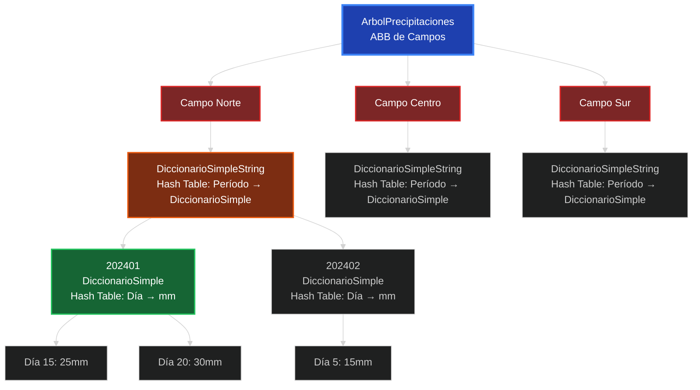

### Capas del Sistema:
- **TDA (Tipos de Datos Abstractos)**: Interfaces que definen las operaciones
- **Implementación**: Clases concretas que implementan los TDAs
- **Algoritmos**: Lógica de negocio que utiliza las implementaciones

### Estructura de 3 Niveles de Datos:
1. **Nivel 1**: ABB de campos agrícolas (ordenamiento lexicográfico)
2. **Nivel 2**: Hash table de períodos AAAAMM para cada campo
3. **Nivel 3**: Hash table de días→precipitaciones para cada período

---

## Árbol de Precipitaciones

### Implementación: `ArbolPrecipitaciones`
**TDA**: `ABBPrecipitacionesTDA`

### Estructura del Nodo

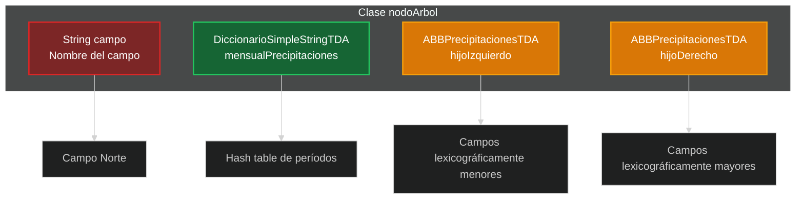

```java
class nodoArbol {
    String campo;                           // Nombre del campo
    DiccionarioSimpleStringTDA mensualPrecipitaciones;  // Hash table de períodos
    ABBPrecipitacionesTDA hijoIzquierdo;   // Subárbol izquierdo
    ABBPrecipitacionesTDA hijoDerecho;     // Subárbol derecho
}
```

### Operaciones Principales

#### 1. Inicialización
```java
public void inicializar() {
    raiz = null;
}
```

#### 2. Agregar Campo
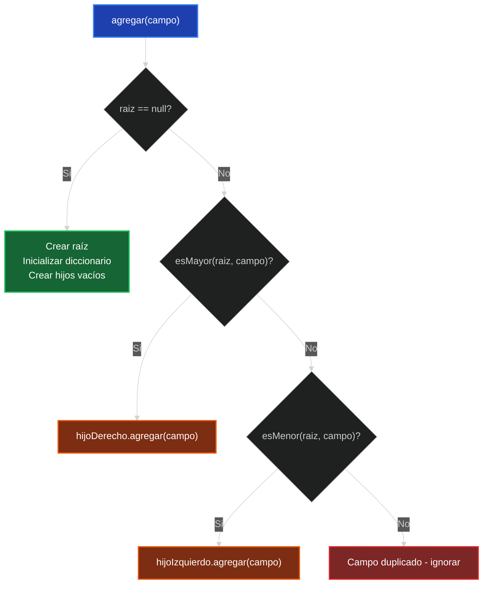

- **Proceso**: Inserción BST estándar con comparación lexicográfica
- **Inicialización automática**: Cada nuevo campo crea su propio `DiccionarioSimpleString`
- **Comparación**: `compareToIgnoreCase()` para orden alfabético insensible a mayúsculas

#### 3. Agregar Medición con Validación
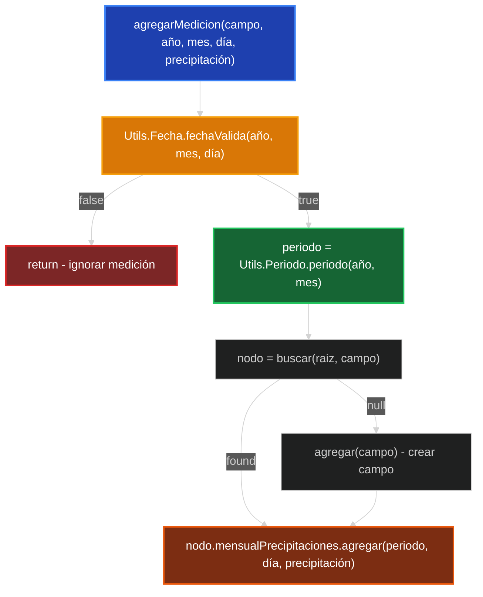

```java
public void agregarMedicion(String valor, String anio, String mes, int dia, int precipitacion) {
    if(!Utils.Fecha.fechaValida(Integer.valueOf(anio), Integer.valueOf(mes), dia)){
        return; // Validación de fecha
    }
    String periodo = Utils.Periodo.periodo(anio, mes);
    // Buscar o crear campo, luego agregar medición
}
```

#### 4. Eliminación de Campo (4 Casos BST)
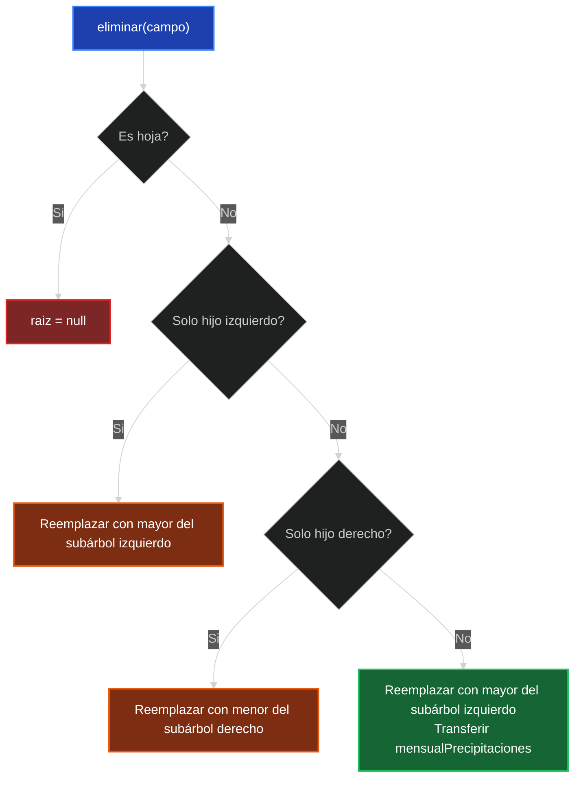

- **Caso 1**: Nodo hoja → `raiz = null`
- **Caso 2**: Solo hijo izquierdo → Reemplazar con mayor del subárbol izquierdo
- **Caso 3**: Solo hijo derecho → Reemplazar con menor del subárbol derecho  
- **Caso 4**: Ambos hijos → Usar in-order successor con transferencia de datos

### Método Crítico: `obtenerNodo()`
```java
private nodoArbol obtenerNodo(ABBPrecipitacionesTDA arbol){
    return ((ArbolPrecipitaciones)arbol).raiz;
}
```
Permite acceso directo al nodo interno para transferir `mensualPrecipitaciones` durante eliminación.

### Algoritmo de Períodos
```java
public ColaStringTDA periodos() {
    ColaStringTDA resultado = new ColaString();
    ConjuntoStringTDA periodosUnicos = new ConjuntoString();
    
    recolectarPeriodos(raiz, periodosUnicos); // DFS para recopilar
    
    // Convertir conjunto a cola
    while(!periodosUnicos.estaVacio()){
        String periodo = periodosUnicos.elegir();
        resultado.acolar(periodo);
        periodosUnicos.sacar(periodo);
    }
    return resultado;
}
```

**Característica especial**: Preserva las claves originales de cada diccionario mediante copia temporal.

---

## Estructuras de Datos Hash

### DiccionarioSimple (Hash Table de Días)
**TDA**: `DiccionarioSimpleTDA`

**Configuración:**
- Capacidad inicial: 16 buckets
- Factor de carga: 0.75
- Colisiones: Separate chaining con listas enlazadas
- Redimensionamiento: Duplica capacidad automáticamente

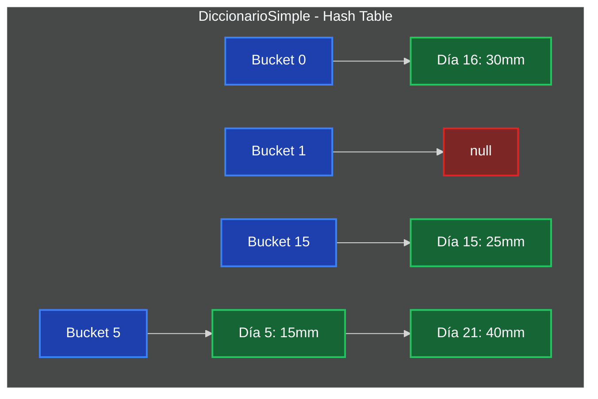

```java
class nodo {
    int clave;      // Día del mes
    int valor;      // Precipitación en mm
    nodo siguiente; // Lista enlazada para colisiones
}
```

#### Función Hash para Enteros
```java
private int hash(int clave) {
    return Math.abs(clave) % capacidad;
}
```

#### Redimensionamiento Automático
- **Condición**: `size >= capacidad * FACTOR_CARGA`
- **Proceso**: Crea nuevo array, rehash todos los elementos
- **Complejidad**: O(n) amortizado a O(1)

### DiccionarioSimpleString (Hash Table de Períodos)
**TDA**: `DiccionarioSimpleStringTDA`

**Estructura de dos niveles:**
- **Nivel 1**: String período → DiccionarioSimpleTDA
- **Nivel 2**: int día → int precipitación

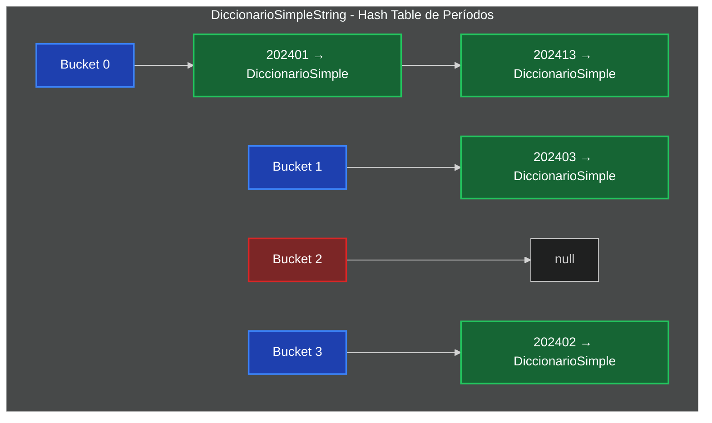

```java
class nodo {
    String periodo;                           // "YYYYMM" format
    DiccionarioSimpleTDA precipitacionesMes; // Hash table interno
    nodo siguiente;                          // Para colisiones
}
```

#### Función Hash para Strings
```java
private int hash(String periodo) {
    if (periodo == null) return 0;
    return Math.abs(periodo.hashCode()) % capacidad;
}
```

#### Operación Especial: `agregar(String periodo, int dia, int cantidad)`
1. Busca período en hash table principal
2. Si no existe: crea nuevo nodo con DiccionarioSimple interno
3. Agrega/actualiza día en diccionario interno
4. Maneja redimensionamiento si es necesario

---

## Estructuras de Datos Lineales

### ColaPrioridad (Lista Enlazada Ordenada)
**TDA**: `ColaPrioridadTDA`

**Ordenamiento**: Por prioridad ascendente (menores prioridades primero)

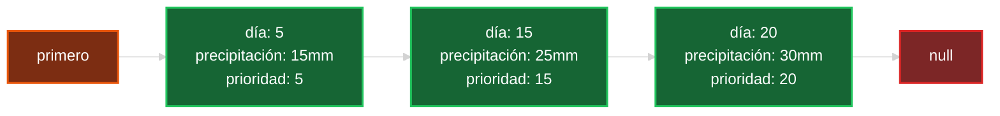

```java
class nodo {
    int valor;      // Precipitación
    int prioridad;  // Día (usado para ordenamiento)
    nodo siguiente;
}
```

#### Inserción Ordenada
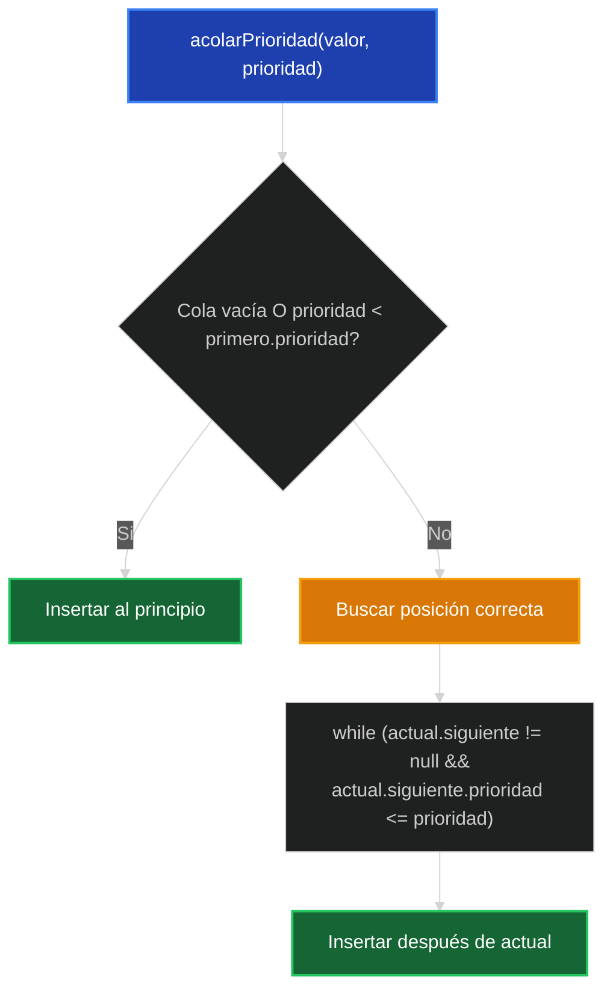

```java
public void acolarPrioridad(int valor, int prioridad) {
    // Buscar posición correcta manteniendo orden ascendente
    // Insertar en posición apropiada
}
```

### ColaString (FIFO)
**TDA**: `ColaStringTDA`

**Optimización crítica**: Puntero `ultimo` para inserción O(1)

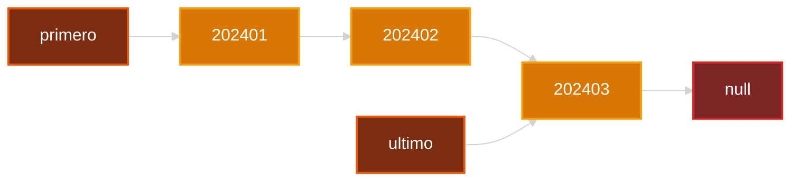

```java
class nodo {
    String valor;
    nodo siguiente;
}
private nodo primero;
private nodo ultimo; // Optimización para acolar O(1)
```

**Conversión automática**: `valor.toLowerCase()` en `acolar()`

### Conjuntos con Hash Tables

#### Conjunto (Hash Table de Enteros)
**TDA**: `ConjuntoTDA`
- Factor de carga: 0.85 (optimizado para `elegir()`)
- Separate chaining para colisiones

#### ConjuntoString (Hash Table de Strings)  
**TDA**: `ConjuntoStringTDA`
- Misma configuración que Conjunto
- Optimizado para selección aleatoria con `elegir()`

#### Método `elegir()` Optimizado
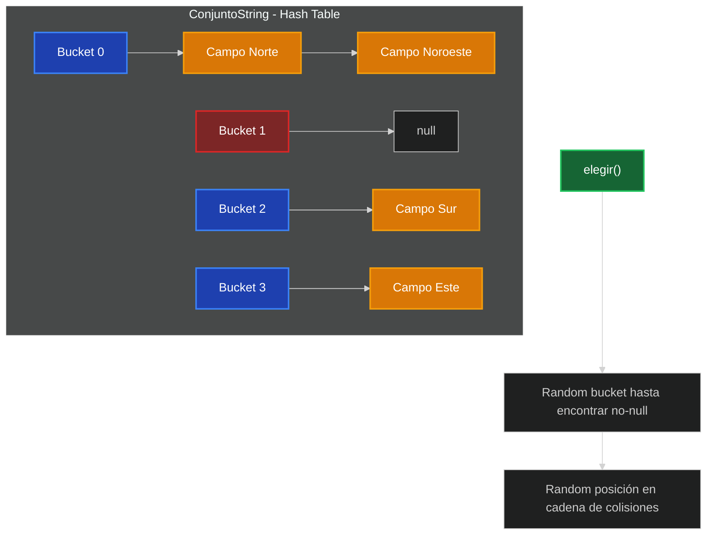

```java
public String elegir() {
    int indice;
    do {
        indice = r.nextInt(capacidad);
    } while (buckets[indice] == null);
    
    // Selección aleatoria dentro de la cadena
    return buckets[indice].valor;
}
```

---

## Utilidades

### Utils.Fecha - Validación Completa

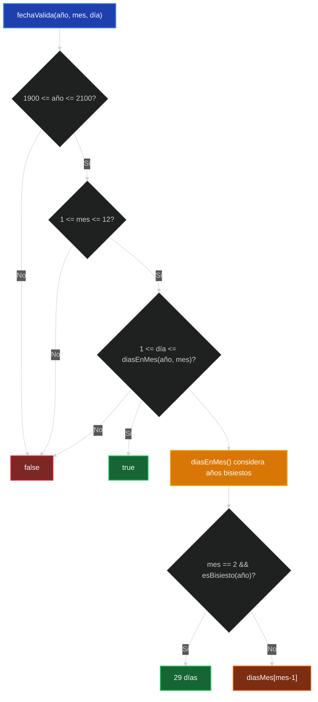

```java
public static boolean fechaValida(int anio, int mes, int dia) {
    if (anio < 1900 || anio > 2100) return false;
    if (mes < 1 || mes > 12) return false;
    if (dia < 1 || dia > diasEnMes(anio, mes)) return false;
    return true;
}
```

**Características:**
- Validación de rangos: años 1900-2100, meses 1-12
- Considera años bisiestos para febrero
- Valida días según el mes específico

#### Algoritmo Año Bisiesto
```java
private static boolean esBisiesto(int anio) {
    return (anio % 4 == 0 && anio % 100 != 0) || (anio % 400 == 0);
}
```

### Utils.Periodo - Generación AAAAMM

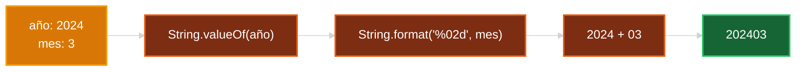

```java
public static String periodo(int anio, int mes) {
    return String.valueOf(anio) + String.format("%02d", mes);
}

public static String periodo(String anio, String mes) {
    return anio + String.format("%02d", Integer.parseInt(mes));
}
```

**Métodos adicionales:**
- `descomponerPeriodo(String)` → `int[]{anio, mes}`
- `obtenerMes(String)` → extrae mes del período
- `obtenerAnio(String)` → extrae año del período

---

## Algoritmos

### Clase `Algoritmos`
**Patrón**: Wrapper que utiliza `ABBPrecipitacionesTDA` interno

### Operaciones CRUD
- `agregarMedicion()`: Delega a árbol con conversión de tipos
- `eliminarMedicion()`: Elimina medición específica
- `eliminarCampo()`: Elimina campo completo

### Algoritmos de Consulta Avanzada

#### 1. `medicionesMes(int anio, int mes)`
**Objetivo**: Promedio de precipitaciones por día en todos los campos

```java
public ColaPrioridadTDA medicionesMes(int anio, int mes) {
    String periodo = Utils.Periodo.periodo(anio, mes);
    DiccionarioSimple acumuladorDias = new DiccionarioSimple();
    DiccionarioSimple contadorCampos = new DiccionarioSimple();
    
    recopilarPrecipitacionesTodosLosCampos(arbol, periodo, acumuladorDias, contadorCampos);
    
    // Calcular promedios y crear cola prioridad
}
```

#### 2. `medicionesCampoMes(String campo, int anio, int mes)`
**Objetivo**: Precipitaciones de un campo específico en un mes

#### 3. `mesMasLluvioso()`
**Objetivo**: Mes con mayor precipitación total histórica

#### 4. `promedioLluviaEnUnDia(int anio, int mes, int dia)`
**Objetivo**: Promedio de precipitación en un día específico entre todos los campos

#### 5. `campoMasLLuvisoHistoria()`
**Objetivo**: Campo con mayor precipitación acumulada total

#### 6. `camposConLLuviaMayorPromedio(int anio, int mes)`
**Objetivo**: Campos que superan el promedio de precipitación en un período

### Algoritmos de Soporte Privados
- `buscarCampo()`: Búsqueda BST de campo específico
- `calcularLluviaPeriodo()`: Suma precipitaciones de un período
- `recopilarPrecipitacionesTodosLosCampos()`: DFS para acumular datos
- `encontrarMesMasLluvioso()`: Búsqueda recursiva del máximo

---

## Flujo de Datos

### Inserción Completa de Medición
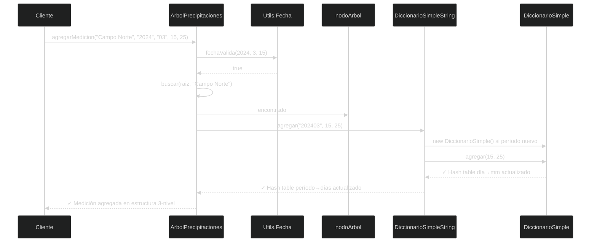

1. **Validación**: `Utils.Fecha.fechaValida()`
2. **Conversión**: `Utils.Periodo.periodo()` 
3. **Búsqueda/Creación**: Campo en ABB
4. **Almacenamiento**: Período → Día → Precipitación (3 niveles)

### Consulta de Períodos
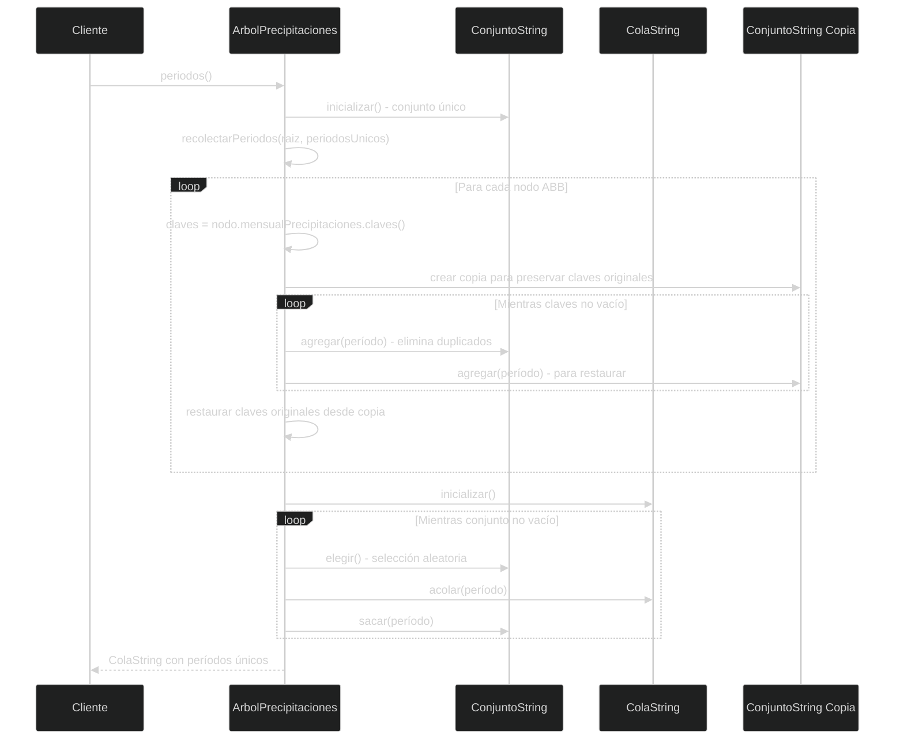

1. **Recolección**: DFS en ABB para obtener todos los períodos
2. **Deduplicación**: Uso de `ConjuntoString` para eliminar duplicados
3. **Preservación**: Copia temporal para mantener diccionarios originales intactos
4. **Resultado**: `ColaString` con períodos únicos

**Nota crítica**: El algoritmo preserva las claves originales de cada diccionario mediante copia temporal.

---

## Complejidades

### Tabla Completa de Complejidades

| Operación | Mejor Caso | Caso Promedio | Peor Caso | Notas |
|-----------|------------|---------------|-----------|--------|
| **ArbolPrecipitaciones** |
| agregar campo | O(1) | O(log n) | O(n) | n = campos, ABB puede degenerarse |
| buscar campo | O(1) | O(log n) | O(n) | Búsqueda recursiva en ABB |
| agregar medición | O(1) | O(log n) | O(n + k) | Incluye validación + hash |
| eliminar campo | O(log n) | O(log n) | O(n) | 4 casos BST + transferencia |
| periodos() | O(m × p) | O(m × p) | O(m × p) | m=campos, p=períodos promedio |
| precipitaciones() | O(d) | O(d) | O(d) | d = días en período específico |
| **Hash Tables (Diccionarios)** |
| agregar | O(1) | O(1) | O(k + n) | k=colisiones, n=redimensionamiento |
| recuperar | O(1) | O(1) | O(k) | k = longitud cadena colisiones |
| eliminar | O(1) | O(1) | O(k) | Búsqueda en cadena |
| obtenerClaves/claves | O(n) | O(n) | O(n) | Recorrer todos los buckets |
| redimensionar | O(n) | O(n) | O(n) | Rehash completo, amortizado |
| **ColaPrioridad** |
| acolarPrioridad | O(1) | O(n/2) | O(n) | Inserción ordenada |
| desacolar | O(1) | O(1) | O(1) | Eliminar primero |
| **ColaString** |
| acolar | O(1) | O(1) | O(1) | Puntero último crítico |
| desacolar | O(1) | O(1) | O(1) | Actualiza último si vacía |
| **Conjuntos Hash** |
| agregar | O(1) | O(1) | O(k + n) | Verificación duplicados + redim |
| pertenece | O(1) | O(1) | O(k) | Hash directo + cadena |
| elegir | O(1) | O(1) | O(c) | c = intentos hasta bucket no-null |
| sacar | O(1) | O(1) | O(k) | Eliminar de cadena |
| **Algoritmos** |
| medicionesMes | O(n × p × d) | O(n × p × d) | O(n × p × d) | DFS completo del árbol |
| mesMasLluvioso | O(n × p × d) | O(n × p × d) | O(n × p × d) | Recorrido completo |
| campoMasLluvioso | O(n × p × d) | O(n × p × d) | O(n × p × d) | Suma total por campo |

### Factores de Carga Optimizados

| Estructura | Factor Carga | Razón |
|------------|--------------|-------|
| DiccionarioSimple | 0.75 | Balance memoria/velocidad |
| DiccionarioSimpleString | 0.75 | Acceso frecuente a períodos |
| Conjunto/ConjuntoString | 0.85 | Optimiza `elegir()` - más buckets ocupados |

### Análisis de Memoria

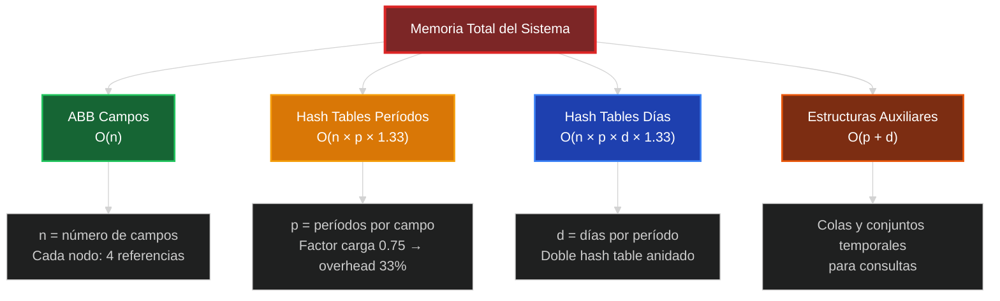

**Memoria total del sistema**: O(n × p × d) donde:
- n = número de campos
- p = períodos promedio por campo  
- d = días promedio por período

**Distribución por estructura:**
- ABB campos: O(n)
- Hash tables períodos: O(n × p × 1.33) 
- Hash tables días: O(n × p × d × 1.33)
- Estructuras auxiliares: O(p + d)

---

## Características Destacadas de la Implementación

### 1. Robustez y Validación
- **Validación completa de fechas**: Años bisiestos, días por mes, rangos válidos (1900-2100)
- **Operaciones seguras**: Métodos no fallan con datos inválidos
- **Preservación de estado**: Algoritmos mantienen integridad de estructuras originales

### 2. Optimizaciones de Rendimiento
- **Hash tables anidados**: Acceso O(1) promedio en 3 niveles
- **Redimensionamiento automático**: Mantiene factor de carga óptimo
- **Puntero último en ColaString**: Evita O(n) en inserción
- **Separate chaining**: Manejo elegante de colisiones

### 3. Algoritmos Sofisticados
- **Eliminación BST completa**: 4 casos con transferencia de datos
- **Elegir() aleatorio optimizado**: Hash table + selección en cadenas
- **Preservación de claves**: Algoritmo de períodos mantiene diccionarios intactos
- **Casting seguro**: `obtenerNodo()` para acceso interno controlado

### 4. Decisiones de Diseño Inteligentes
- **Factor de carga diferenciado**: 0.75 vs 0.85 según uso
- **Conversión automática**: `toLowerCase()` en ColaString
- **Sobrecarga de métodos**: Utils.Periodo para flexibilidad
- **Manejo de null**: Funciones hash robustas ante valores nulos

### 5. Arquitectura en Capas
- **Separación clara**: TDA → Implementación → Algoritmos
- **Interfaces bien definidas**: Cada TDA especifica su contrato
- **Reutilización**: Implementaciones utilizadas por múltiples algoritmos
- **Mantenibilidad**: Cambios en implementación no afectan algoritmos

---

*Sistema de Precipitaciones Agrícolas - Algoritmos y Estructuras de Datos II* 