# Sistema de Precipitaciones Agrícolas - Documentación de Implementaciones

## Índice
1. [Arquitectura General](#arquitectura-general)
2. [Árbol de Precipitaciones](#árbol-de-precipitaciones)
3. [Estructuras de Datos de Soporte](#estructuras-de-datos-de-soporte)
4. [Utilidades](#utilidades)
5. [Flujo de Datos](#flujo-de-datos)
6. [Complejidades](#complejidades)

---

## Arquitectura General

El sistema implementa una estructura de datos jerárquica para almacenar y consultar precipitaciones en campos agrícolas organizados por períodos temporales.

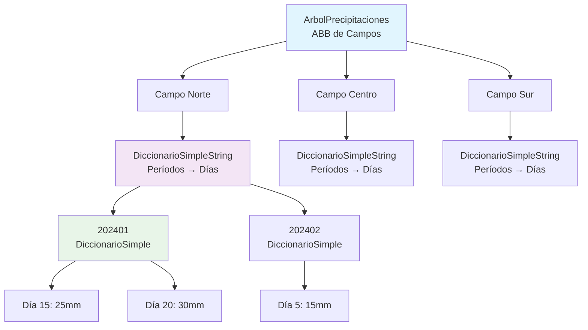

---

## Árbol de Precipitaciones

### Estructura Principal

La clase `ArbolPrecipitaciones` implementa un **Árbol Binario de Búsqueda (ABB)** donde cada nodo representa un campo agrícola.

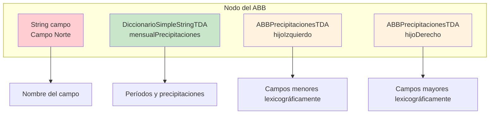

### Operaciones Principales

#### 1. Agregar Campo
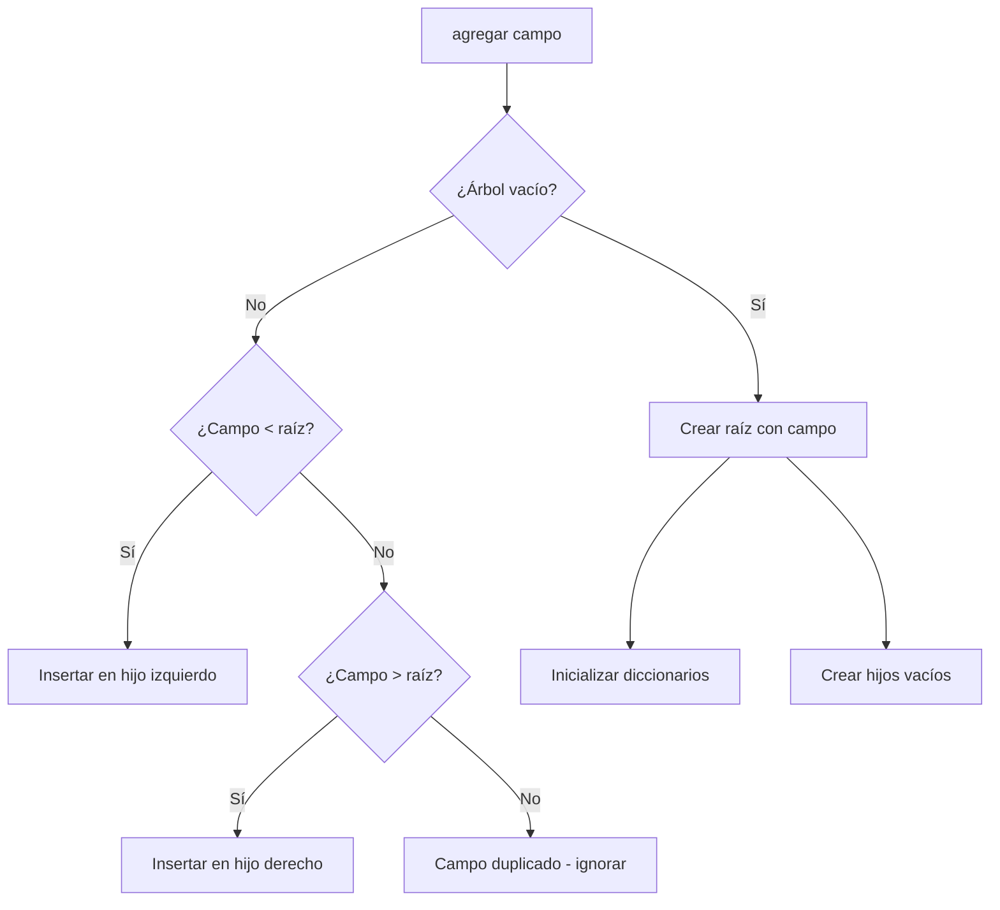

#### 2. Agregar Medición
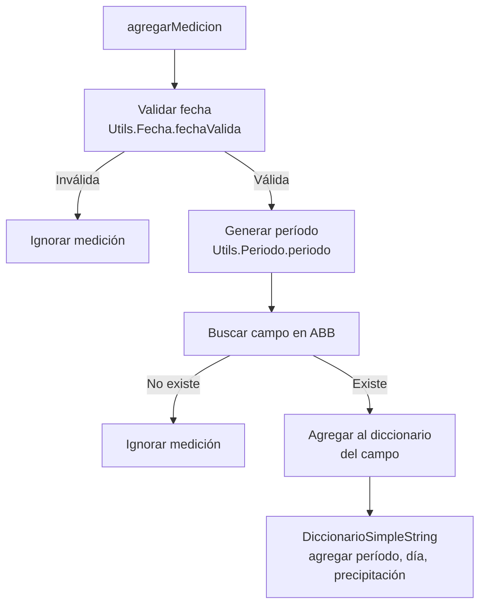

#### 3. Obtener Períodos
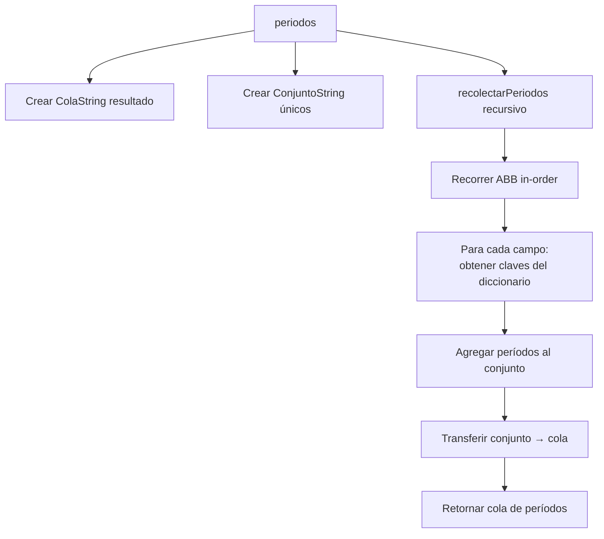

---

## Estructuras de Datos de Soporte

### DiccionarioSimpleString

Implementa un **Hash Table** que mapea períodos (strings) a diccionarios de precipitaciones diarias.

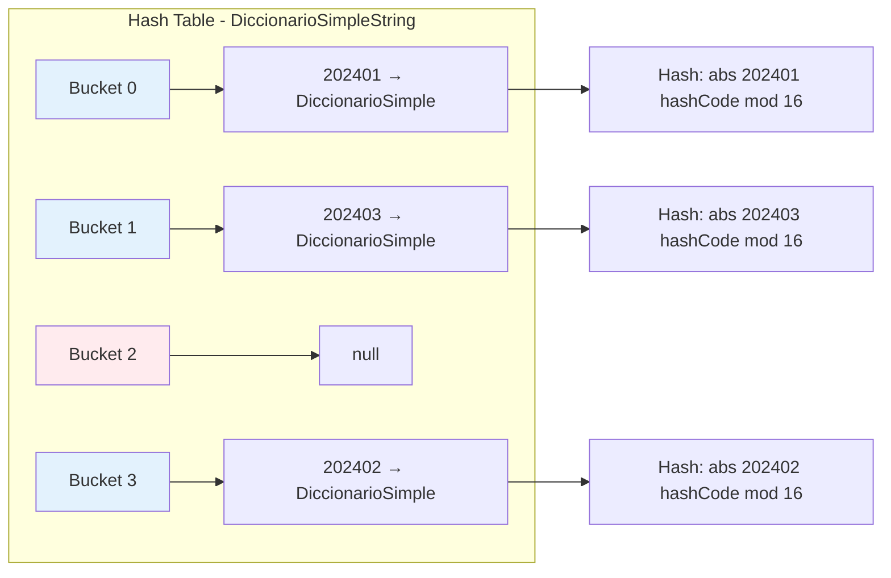

#### Función Hash para Strings
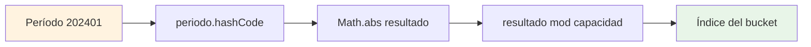

### DiccionarioSimple

Hash Table que mapea días (int) a precipitaciones (int).

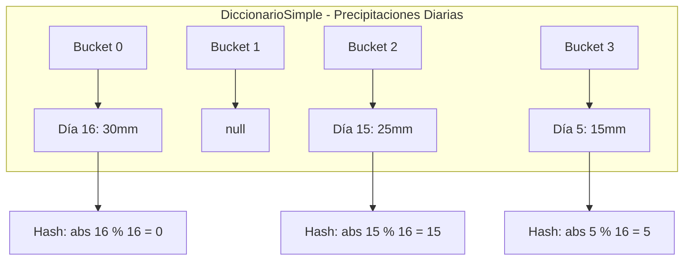

#### Redimensionamiento Automático
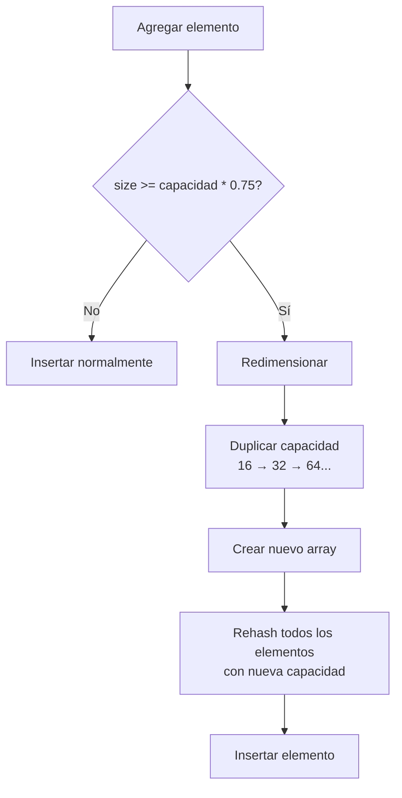

### ColaPrioridad

Lista enlazada ordenada por prioridad (días cronológicos).

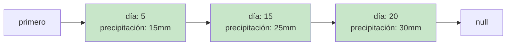

#### Inserción Ordenada
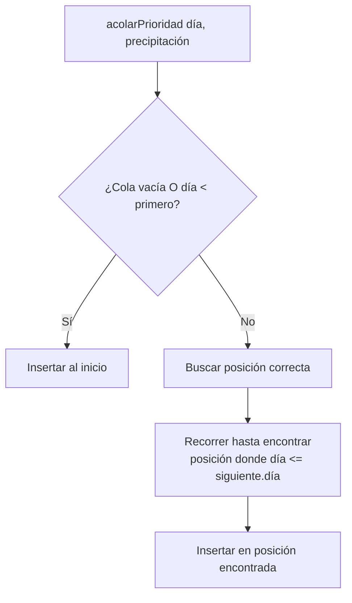

### ColaString

Cola FIFO para períodos con conversión automática a minúsculas.

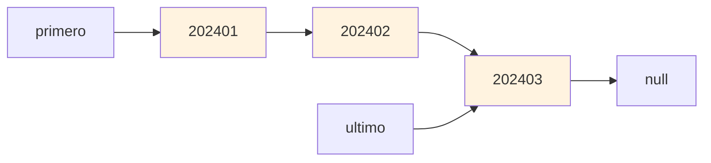

### Conjuntos (Conjunto y ConjuntoString)

Listas enlazadas sin duplicados con selección aleatoria.

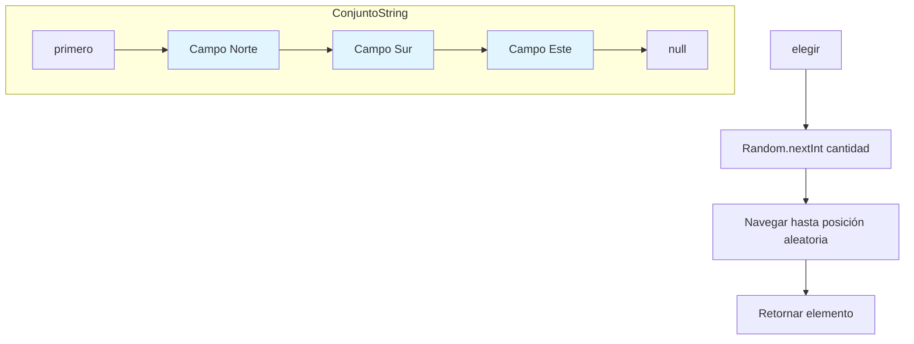

---

## Utilidades

### Utils.Fecha

Validación completa de fechas con soporte para años bisiestos.

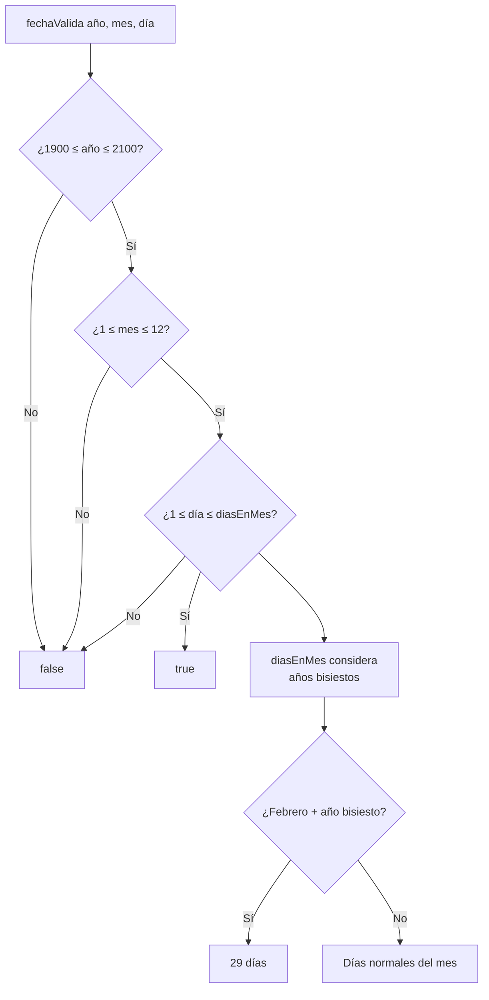

#### Algoritmo Año Bisiesto
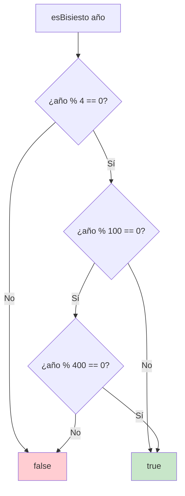

### Utils.Periodo

Generación de períodos en formato AAAAMM.

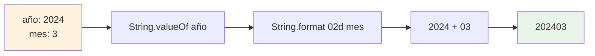

---

## Flujo de Datos

### Inserción de Medición Completa
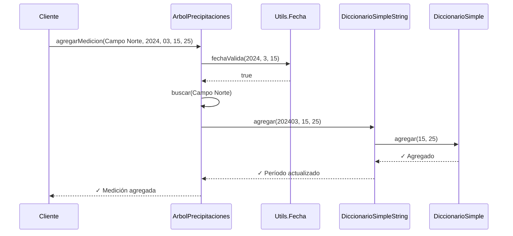

### Consulta de Períodos
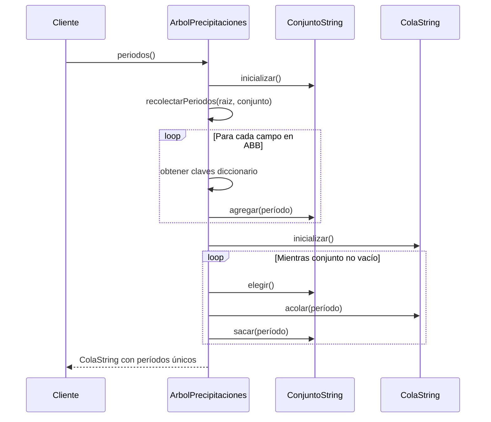

---

## Complejidades

### Tabla de Complejidades por Operación

| Operación | Mejor Caso | Caso Promedio | Peor Caso | Notas |
|-----------|------------|---------------|-----------|--------|
| **ArbolPrecipitaciones** |
| agregar campo | O(1) | O(log n) | O(n) | n = número de campos |
| buscar campo | O(1) | O(log n) | O(n) | ABB puede degenerarse |
| agregar medición | O(1) | O(log n + 1) | O(n + k) | k = colisiones hash |
| periodos() | O(n) | O(n) | O(n) | n = total de períodos |
| eliminar campo | O(1) | O(log n) | O(n) | Incluye reorganización ABB |
| **DiccionarioSimpleString** |
| agregar | O(1) | O(1) | O(k) | k = tamaño bucket |
| recuperar | O(1) | O(1) | O(k) | Con redimensionamiento |
| eliminar | O(1) | O(1) | O(k) | Amortizado por rehashing |
| **DiccionarioSimple** |
| agregar | O(1) | O(1) | O(k) | Hash table con rehashing |
| recuperar | O(1) | O(1) | O(k) | Búsqueda en bucket |
| eliminar | O(1) | O(1) | O(k) | k = colisiones |
| **ColaPrioridad** |
| acolar | O(1) | O(n) | O(n) | n = elementos en cola |
| desacolar | O(1) | O(1) | O(1) | Eliminar primero |
| **Conjuntos y Colas** |
| agregar/acolar | O(1) | O(1) | O(n) | Verificación duplicados |
| pertenece | O(1) | O(n/2) | O(n) | Búsqueda lineal |
| elegir | O(1) | O(n/2) | O(n) | Acceso aleatorio |

### Análisis de Memoria

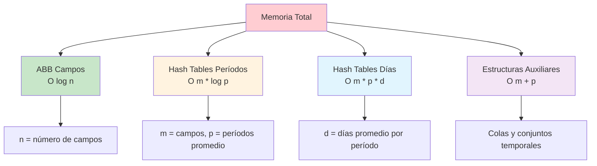

**Donde:**
- **n** = número de campos agrícolas
- **m** = número de campos con datos
- **p** = número promedio de períodos por campo
- **d** = número promedio de días con datos por período
- **k** = número de colisiones en hash table

---

## Características de Implementación

### Ventajas del Diseño
1. **Escalabilidad**: Hash tables con redimensionamiento automático
2. **Eficiencia**: Acceso O(1) promedio a datos específicos
3. **Robustez**: Validación completa de fechas y manejo de errores
4. **Flexibilidad**: Estructura jerárquica adaptable a diferentes consultas
5. **Memoria**: Uso eficiente con estructuras dinámicas

### Decisiones de Diseño
1. **ABB para campos**: Permite consultas ordenadas y búsqueda eficiente
2. **Hash tables anidados**: Optimiza acceso por período y día
3. **Validación estricta**: Garantiza integridad de datos temporales
4. **Estructuras auxiliares**: Facilitan consultas complejas y agregaciones
5. **Factor de carga 0.75**: Balance entre memoria y rendimiento

---

*Documentación generada para el Sistema de Precipitaciones Agrícolas*  
*Algoritmos y Estructuras de Datos II - 2024* 