# Sistema de Precipitaciones Agrícolas - Documentación de Implementaciones

## Índice
1. [Arquitectura General](#arquitectura-general)
2. [Árbol de Precipitaciones](#árbol-de-precipitaciones)
3. [Estructuras de Datos Hash](#estructuras-de-datos-hash)
4. [Estructuras de Datos Lineales](#estructuras-de-datos-lineales)
5. [Utilidades](#utilidades)
6. [Flujo de Datos](#flujo-de-datos)
7. [Complejidades](#complejidades)

---

## Arquitectura General

El sistema implementa una estructura de datos jerárquica de 3 niveles para almacenar precipitaciones agrícolas:

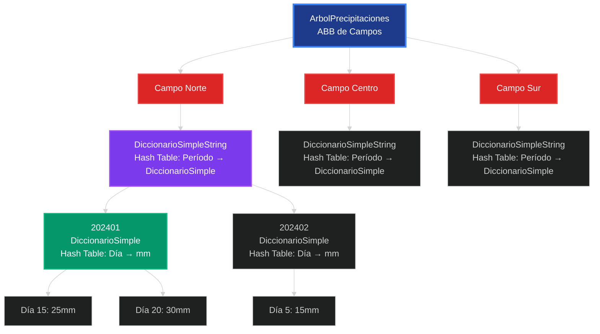

**Estructura de 3 Niveles:**
1. **Nivel 1**: ABB de campos agrícolas (ordenamiento lexicográfico)
2. **Nivel 2**: Hash table de períodos AAAAMM para cada campo
3. **Nivel 3**: Hash table de días→precipitaciones para cada período

---

## Árbol de Precipitaciones

### Estructura del Nodo

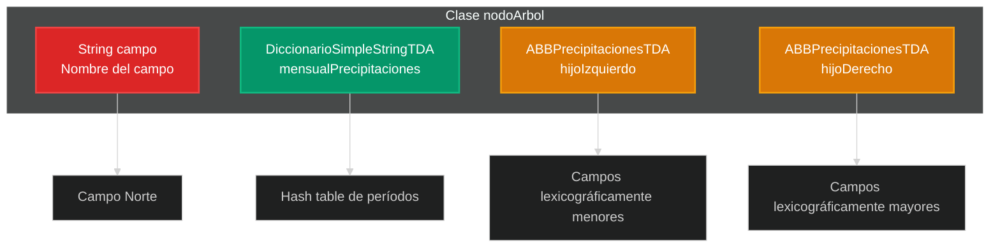

### Operaciones Principales

#### 1. Agregar Campo
```mermaid
%%{init: {'theme':'dark'}}%%
flowchart TD
    A["agregar(campo)"] --> B{¿raiz == null?}
    B -->|Sí| C["Crear raíz<br/>Inicializar diccionario<br/>Crear hijos vacíos"]
    B -->|No| D{¿esMayor(raiz, campo)?}
    D -->|Sí| E["hijoDerecho.agregar(campo)"]
    D -->|No| F{¿esMenor(raiz, campo)?}
    F -->|Sí| G["hijoIzquierdo.agregar(campo)"]
    F -->|No| H["Campo duplicado - ignorar"]
    
    style A fill:#1e3a8a,stroke:#3b82f6,stroke-width:2px,color:#fff
    style C fill:#059669,stroke:#10b981,stroke-width:2px,color:#fff
    style E fill:#7c3aed,stroke:#a855f7,stroke-width:2px,color:#fff
    style G fill:#7c3aed,stroke:#a855f7,stroke-width:2px,color:#fff
    style H fill:#dc2626,stroke:#ef4444,stroke-width:2px,color:#fff
```

#### 2. Agregar Medición con Validación
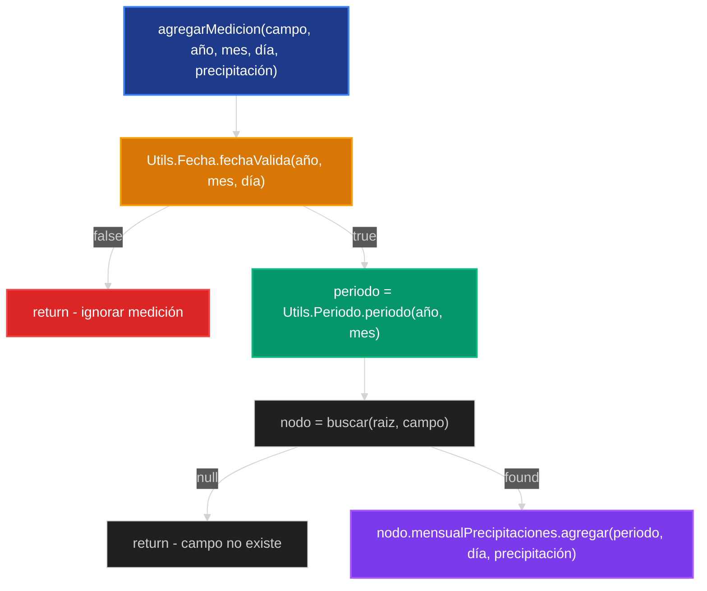

#### 3. Eliminación de Campo (4 Casos BST)
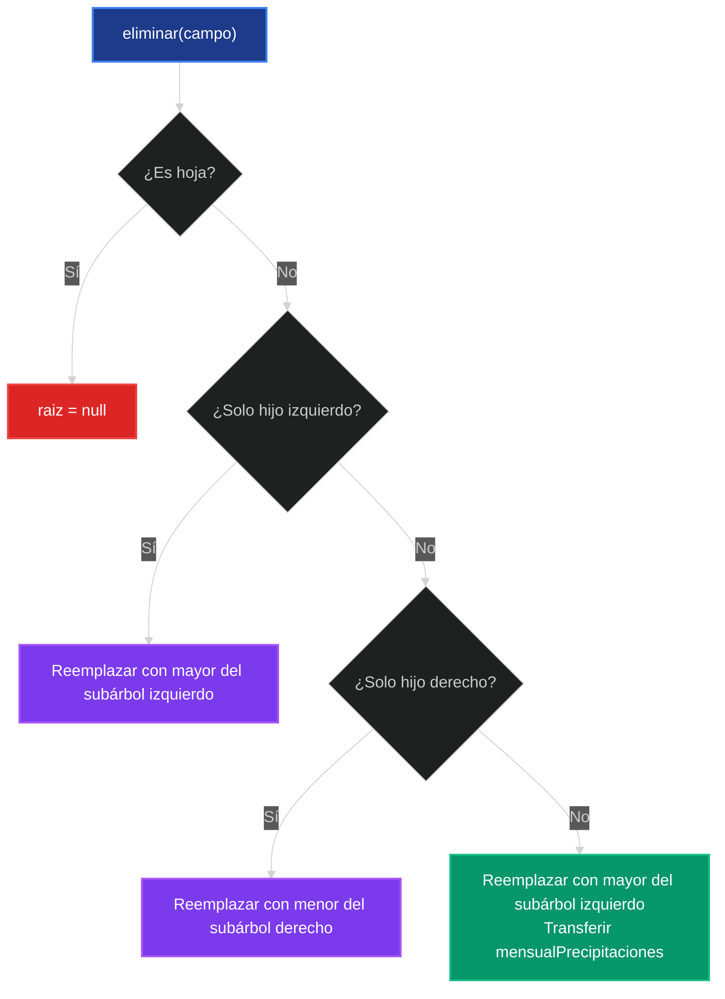

### Método Crítico: obtenerNodo()
```java
private nodoArbol obtenerNodo(ABBPrecipitacionesTDA arbol){
    return ((ArbolPrecipitaciones)arbol).raiz;
}
```
Este método permite acceso directo al nodo interno para transferir `mensualPrecipitaciones` durante eliminación.

---

## Estructuras de Datos Hash

### DiccionarioSimpleString (Hash Table de Períodos)

**Configuración:**
- Capacidad inicial: 16 buckets
- Factor de carga: 0.75
- Colisiones: Separate chaining con listas enlazadas
- Redimensionamiento: Duplica capacidad automáticamente

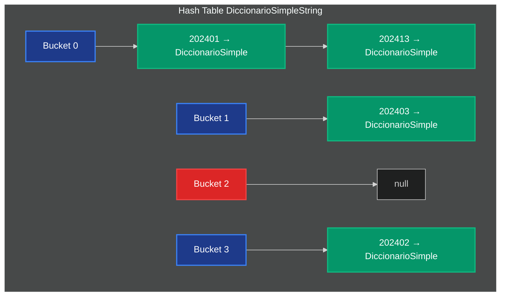

#### Función Hash para Strings
```java
private int hash(String periodo) {
    if (periodo == null) return 0;
    return Math.abs(periodo.hashCode()) % capacidad;
}
```

#### Redimensionamiento Inteligente
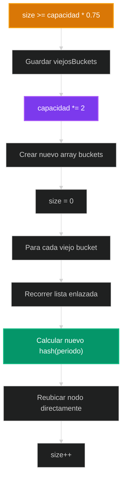

### DiccionarioSimple (Hash Table de Días)

**Configuración idéntica** pero para mapeo `int día → int precipitación`:

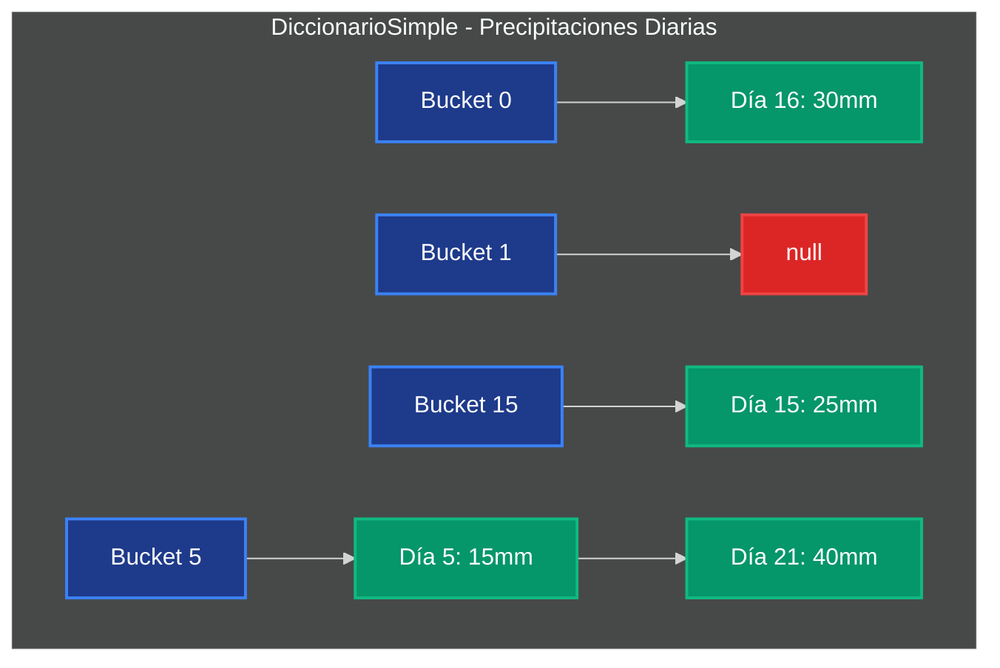

#### Función Hash para Enteros
```java
private int hash(int clave) {
    return Math.abs(clave) % capacidad;
}
```

---

## Estructuras de Datos Lineales

### ColaPrioridad (Lista Enlazada Ordenada)

**Ordenamiento:** Por prioridad ascendente (días cronológicos)

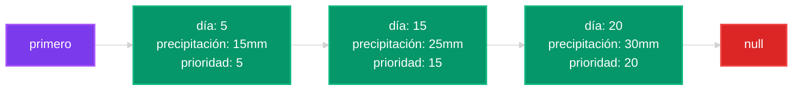

#### Inserción Ordenada
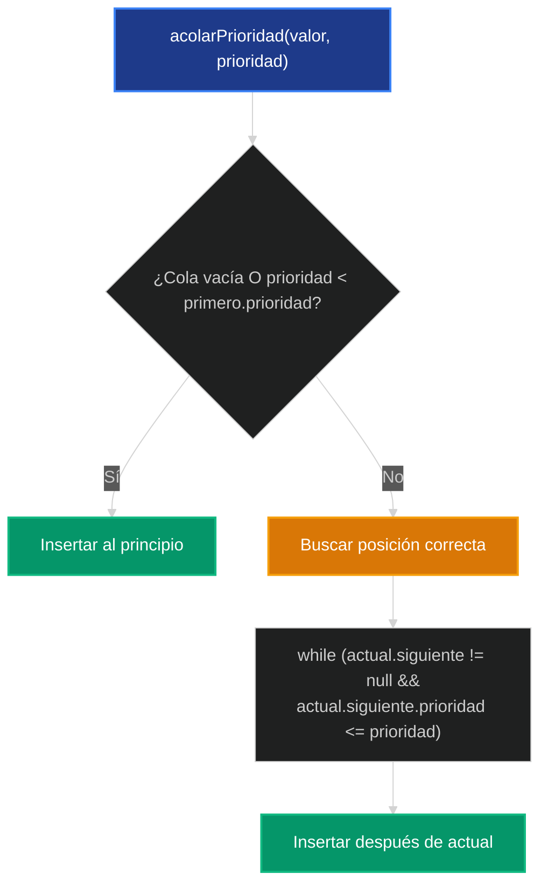

### ColaString (FIFO con Puntero Último)

**Optimización crítica:** Puntero `ultimo` para inserción O(1)

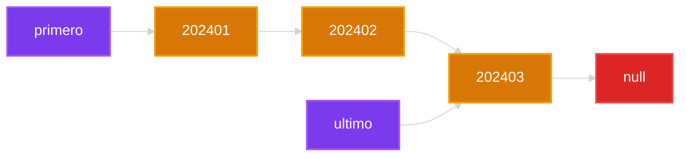

**Conversión automática:** `valor.toLowerCase()` en `acolar()`

### Conjuntos con Hash Tables

Ambos `Conjunto` y `ConjuntoString` usan **separate chaining**:

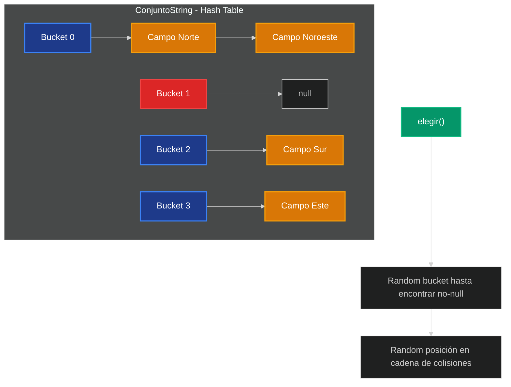

#### Elegir() Optimizado
```java
int indice;
do {
    indice = r.nextInt(capacidad);
} while (buckets[indice] == null);

```

**Factor de carga:** 0.85 (mayor que diccionarios para optimizar `elegir()`)

---

## Utilidades

### Utils.Fecha - Validación Completa

```mermaid
%%{init: {'theme':'dark'}}%%
flowchart TD
    A["fechaValida(año, mes, día)"] --> B{¿1900 ≤ año ≤ 2100?}
    B -->|No| C["false"]
    B -->|Sí| D{¿1 ≤ mes ≤ 12?}
    D -->|No| C
    D -->|Sí| E{¿1 ≤ día ≤ diasEnMes(año, mes)?}
    E -->|No| C
    E -->|Sí| F["true"]
    
    E --> G["diasEnMes() considera años bisiestos"]
    G --> H{¿mes == 2 && esBisiesto(año)?}
    H -->|Sí| I["29 días"]
    H -->|No| J["diasMes[mes-1]"]
    
    style A fill:#1e3a8a,stroke:#3b82f6,stroke-width:2px,color:#fff
    style C fill:#dc2626,stroke:#ef4444,stroke-width:2px,color:#fff
    style F fill:#059669,stroke:#10b981,stroke-width:2px,color:#fff
    style G fill:#d97706,stroke:#f59e0b,stroke-width:2px,color:#fff
    style I fill:#059669,stroke:#10b981,stroke-width:2px,color:#fff
    style J fill:#7c3aed,stroke:#a855f7,stroke-width:2px,color:#fff
```

#### Algoritmo Año Bisiesto
```java
private static boolean esBisiesto(int anio) {
    return (anio % 4 == 0 && anio % 100 != 0) || (anio % 400 == 0);
}
```

### Utils.Periodo - Generación AAAAMM

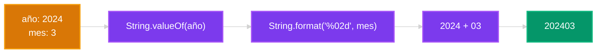

**Sobrecarga de métodos:**
```java
static String periodo(int anio, int mes)      // Para conversión interna
static String periodo(String anio, String mes) // Para API pública
```

---

## Flujo de Datos

### Inserción Completa de Medición
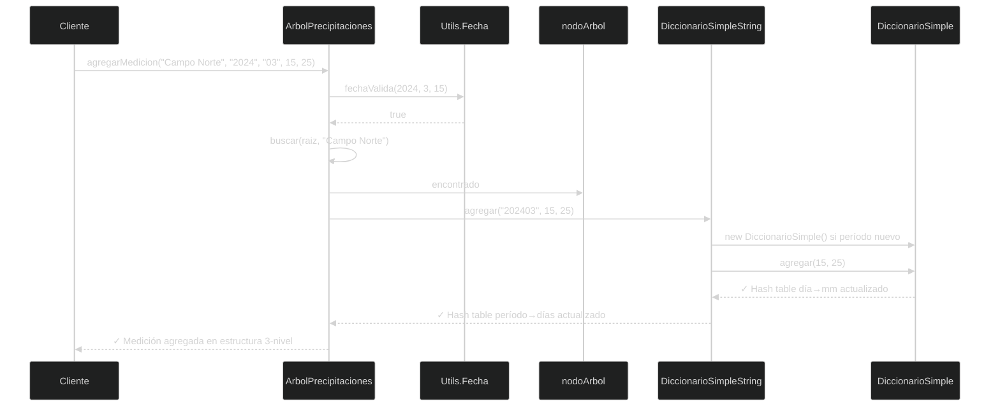

### Consulta de Períodos (Algoritmo Complejo)
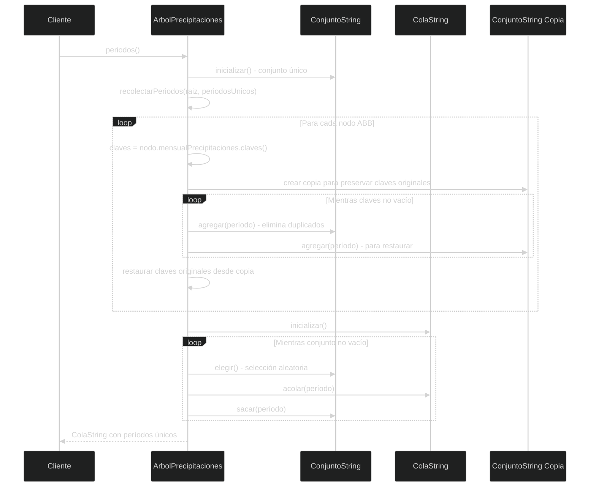

**Nota crítica:** El algoritmo preserva las claves originales de cada diccionario mediante copia temporal.

---

## Complejidades

### Tabla Completa de Complejidades

| Operación | Mejor Caso | Caso Promedio | Peor Caso | Notas Implementación |
|-----------|------------|---------------|-----------|---------------------|
| **ArbolPrecipitaciones** |
| agregar campo | O(1) | O(log n) | O(n) | n = campos, ABB puede degenerarse |
| buscar campo | O(1) | O(log n) | O(n) | Búsqueda recursiva en ABB |
| agregar medición | O(1) | O(log n + 1) | O(n + k) | Incluye validación + hash |
| eliminar campo | O(log n) | O(log n) | O(n) | Casos BST + transferencia datos |
| periodos() | O(m × p) | O(m × p) | O(m × p) | m=campos, p=períodos promedio |
| precipitaciones() | O(d) | O(d) | O(d) | d = días en período específico |
| **Hash Tables (Diccionarios)** |
| agregar | O(1) | O(1) | O(k + n) | k=colisiones, n=redimensionamiento |
| recuperar | O(1) | O(1) | O(k) | k = longitud cadena colisiones |
| eliminar | O(1) | O(1) | O(k) | Búsqueda en cadena |
| claves/obtenerClaves | O(n) | O(n) | O(n) | Debe recorrer todos los buckets |
| redimensionar | O(n) | O(n) | O(n) | Rehash completo, amortizado |
| **ColaPrioridad** |
| acolarPrioridad | O(1) | O(n/2) | O(n) | Inserción ordenada por día |
| desacolar | O(1) | O(1) | O(1) | Eliminar primero |
| **ColaString** |
| acolar | O(1) | O(1) | O(1) | Puntero último crítico |
| desacolar | O(1) | O(1) | O(1) | Actualiza puntero último si vacía |
| **Conjuntos Hash** |
| agregar | O(1) | O(1) | O(k + n) | Verificación duplicados + redim |
| pertenece | O(1) | O(1) | O(k) | Hash directo + cadena |
| elegir | O(1) | O(1) | O(c) | c = intentos hasta bucket no-null |
| sacar | O(1) | O(1) | O(k) | Eliminar de cadena |

### Análisis de Memoria por Estructura

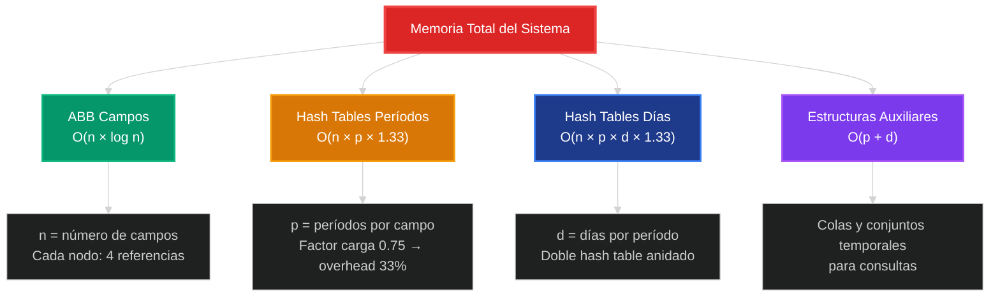

### Factores de Carga Optimizados

| Estructura | Factor Carga | Razón |
|------------|--------------|-------|
| DiccionarioSimpleString | 0.75 | Balance memoria/velocidad para períodos |
| DiccionarioSimple | 0.75 | Acceso frecuente a días específicos |
| Conjunto/ConjuntoString | 0.85 | Optimiza `elegir()` - más buckets ocupados |

---

## Características Destacadas de la Implementación

### 1. Robustez y Validación
- **Validación completa de fechas:** Años bisiestos, días por mes, rangos válidos
- **Operaciones seguras:** Métodos no fallan con datos inválidos
- **Preservación de estado:** Algoritmos mantienen integridad de estructuras originales

### 2. Optimizaciones de Rendimiento
- **Hash tables anidados:** Acceso O(1) promedio en 3 niveles
- **Redimensionamiento automático:** Mantiene factor de carga óptimo
- **Puntero último en ColaString:** Evita O(n) en inserción
- **Separate chaining:** Manejo elegante de colisiones

### 3. Algoritmos Sofisticados
- **Eliminación BST completa:** 4 casos con transferencia de datos
- **Elegir() aleatorio optimizado:** Hash table + selección en cadenas
- **Preservación de claves:** Algoritmo de períodos mantiene diccionarios intactos
- **Casting seguro:** `obtenerNodo()` para acceso interno controlado

### 4. Decisiones de Diseño Inteligentes
- **Factor de carga diferenciado:** 0.75 vs 0.85 según uso
- **Conversión automática:** `toLowerCase()` en ColaString
- **Sobrecarga de métodos:** Utils.Periodo para flexibilidad
- **Manejo de null:** Funciones hash robustas ante valores nulos

---

*Documentación técnica basada en análisis completo del código fuente*  
*Sistema de Precipitaciones Agrícolas - Algoritmos y Estructuras de Datos II* 